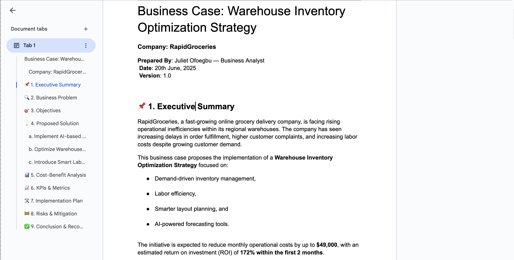

# Warehouse Inventory Optimization – RapidGroceries

## Project Summary
This project explores warehouse operations at RapidGroceries, a fast-growing online grocery delivery company. I was tasked with analyzing inventory and operations data to uncover inefficiencies, improve fulfillment times, and reduce costs. The goal was to optimize stock levels, labor usage, and warehouse layout through data analysis, dashboards, and a formal business case.

Uncleaned dataset: 'warehouse_inventory_data.xlsx'

## Business Objectives
- Reduce order fulfillment delays and stockouts
- Minimize storage and labor costs
- Identify fast- and slow-moving SKUs
- Improve picking and warehouse layout efficiency
- Propose technology-driven solutions (AI forecasting, smart labor planning)

## Technologies Used
- **Excel** – for data cleaning and initial exploration
- **Pandas (Python)** – for deeper analysis (root cause, derived metrics)
- **Power BI** – for dashboards and KPI visualization
- **Canva** – for creating the stakeholder pitch deck
- **Word** – for writing the business case document

## Key Insights Derived
- 51.6% of SKUs experienced stockouts in the last 3 months
- 25% increase in labor overtime due to poor shift scheduling
- Overstock of slow-moving items inflated storage costs
- Static reorder points caused stock imbalances
- Manual scheduling and outdated layout slowed fulfillment

## KPIs Tracked in Dashboard
- Inventory Turnover Ratio
- Total Stockouts
- Fulfillment Time by Category
- Labor Cost Trends
- Return Rate by Category
- Fast vs. Slow-Moving SKUs
- At-Risk SKUs (low stock + high demand)

## Deliverables

### 1. Exploratory Data Analysis
Cleaned the dataset, derived new metrics (`days_to_stockout`, `is_slow_moving`), segmented SKUs.
Exploration: 'Warehouse-inventory-data.ipynb' file
Cleaned & explored dataset in: 'cleaned_warehouse_inventory_data.csv' file

### 2. Dashboard Visualization
Created a 3-tab Power BI dashboard:
- **Warehouse Health**
- **Fulfillment & Labor**
- **Forecasting & Optimization**

### 3. Root Cause Analysis
Used trends, calculations, and patterns to identify inefficiencies:
- Poor demand forecasting
- Ineffective picking layout
- Manual labor shift design

### 4. Business Case Document
Proposed a solution combining:
- AI-based demand forecasting
- Warehouse layout redesign
- Smart labor scheduling
With a projected monthly savings of **$49,000** and an ROI payback in **in 2 months**.

**[📎 Download Full Business Case Document](Business-Case:Warehouse-Inventory-Optimization-Strategy.docx)**

### ✅ 5. Pitch Deck
Presented the findings and recommendations to stakeholders through a 10-slide pitch deck.

**[📎 Download Pitch Deck (PDF)](Warehouse-Optimization-Strategy-Pitch Slide-Deck-for-RapidGroceries.pdf)**

---

## 👩🏽‍💼 Business Analyst Skills Demonstrated
- Operational efficiency & logistics analysis
- Data storytelling and visualization
- Cost-benefit and ROI analysis
- Stakeholder communication
- Business case writing & presentation

---

> **Note:** This capstone project concludes my 7-week Business Analysis study journey. It combines technical and analytical skills to solve real-world operational problems with data-driven recommendations.

